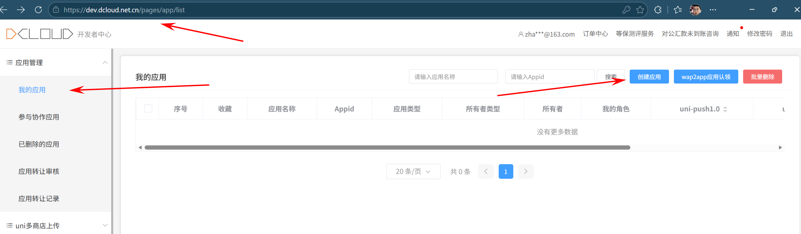
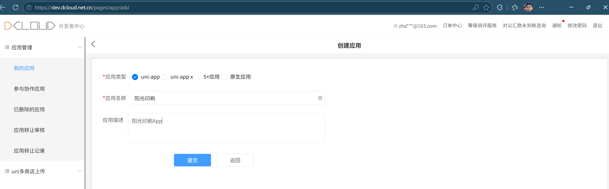
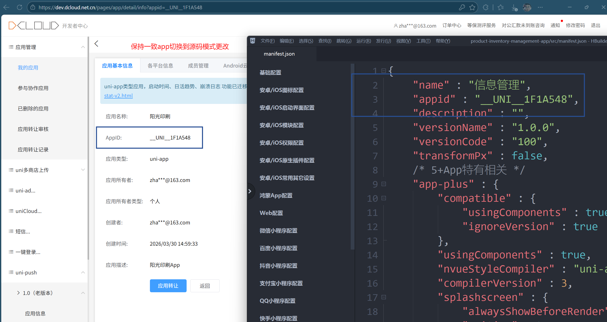
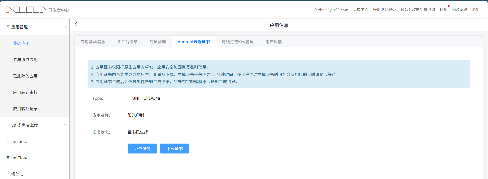
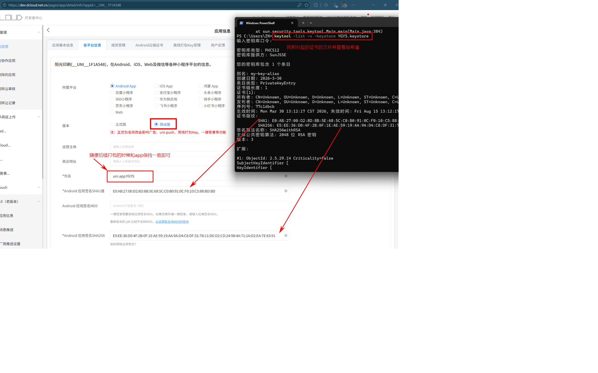
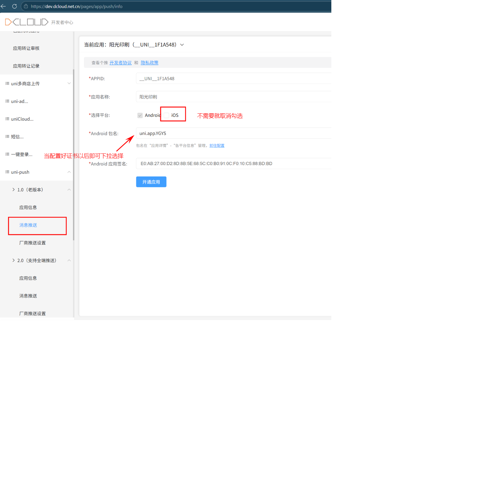
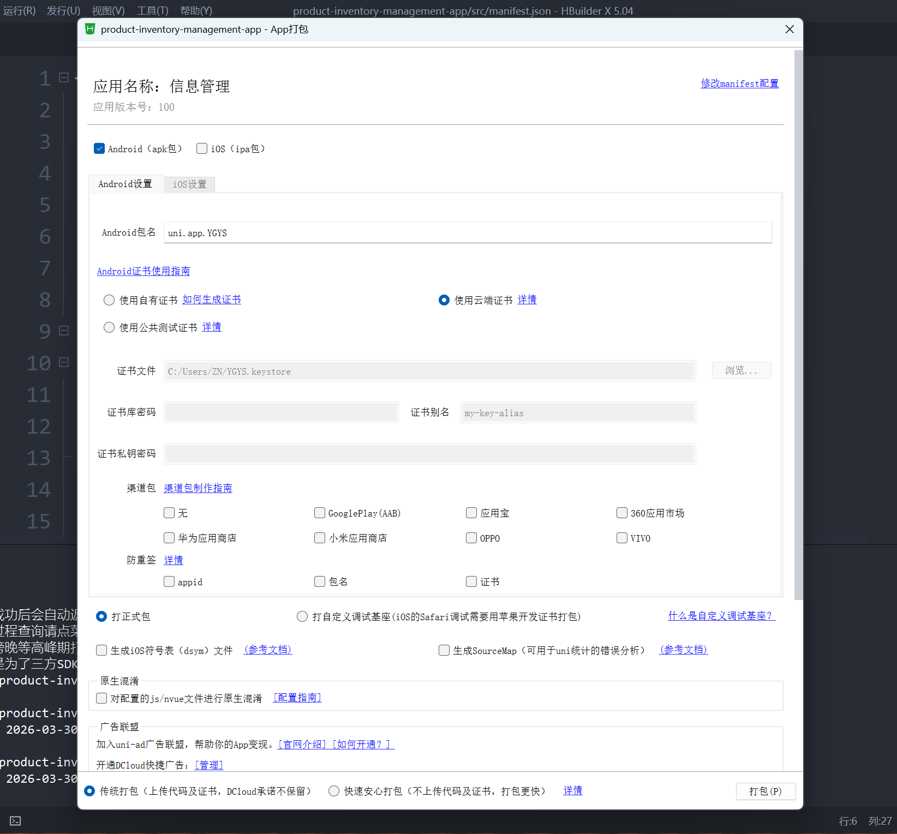
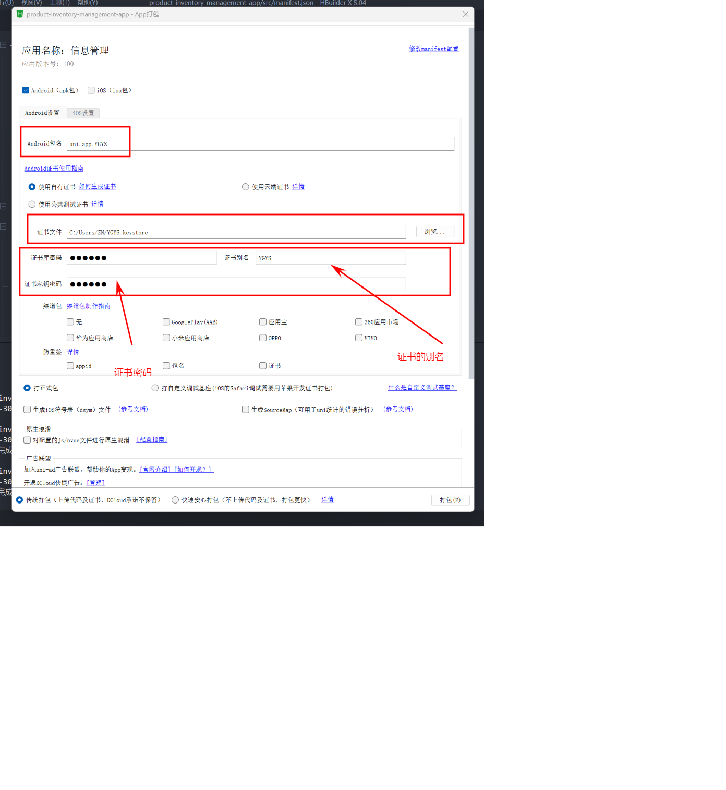

## 一、DCloud 开发者中心配置

### 1. 创建或选择应用

登录 DCloud 开发者中心后，先创建应用或选择已有应用。





### 2. 选择证书方案

可选两种签名方式：

1. 云端证书：直接使用平台托管证书。
2. 本地证书：使用你自己生成的 `keystore` 文件。

使用云端证书：



使用本地 `keystore` 证书时，选择本地文件并填写密码：




## 二、HBuilderX 云打包配置

### 1. 打开云打包

在 HBuilderX 中打开项目后，点击工具栏的云打包。



### 2. 填写自有证书信息

在云打包页面选择“自有证书”，填写以下信息后保存：

| 配置项 | 说明 |
| --- | --- |
| 证书文件 | 选择 `YGYS.keystore` |
| Alias | 与证书中的别名一致（如 `YGYS`） |
| Store Password | 密钥库密码 |
| Key Password | 密钥密码（通常与密钥库密码一致） |



### 3. 命令行快速核对证书信息

如果忘记 alias 或不确定证书内容，可在命令行执行：

```powershell
keytool -list -keystore YGYS.keystore
```

查看完整证书详情：

```powershell
keytool -list -v -keystore YGYS.keystore
```

## 三、常见问题排查

1. 提示证书密码错误：确认 `Store Password` 与 `Key Password` 是否填写正确。
2. 提示 alias 不存在：用 `keytool -list` 核对别名后再填写。
3. 打包后安装失败：检查应用包名与签名证书是否和历史版本一致。
