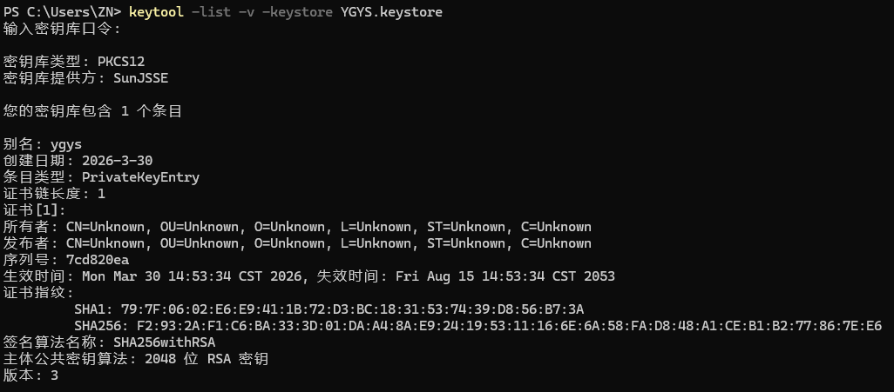

# Android 签名证书完整文档（含生成与配置）

## 一、签名生成历史记录

### 1. 生成密钥库命令

```powershell

keytool -genkey -v -keystore YGYS.keystore -alias my-key-alias -keyalg RSA -keysize 2048 -validity 10000

# YGYS.keystore 自定义文件名，
# my-key-alias 自定义密钥别名，
# RSA 2048 位加密算法，有效期 10000 天

# 生成文件：YGYS.keystore（初始为 JKS 格式）交互信息：所有身份信息均填写为 # Unknown，国家 / 地区代码为 CN，密钥密码与密钥库密码一致

```


### 2. 迁移为标准 PKCS12 格式命令

```powershell
keytool -genkey -v -keystore YGYS.keystore -alias YGYS -keyalg RSA -keysize 2048 -validity 10000 -storetype PKCS12

# 直接生成 PKCS12 格式的密钥库，文件名仍为 YGYS.keystore，别名为 YGYS，其他参数同上

```

### 3. 删除旧 JKS 文件并备份

```powershell
del YGYS.keystore.old
ren YGYS.keystore YGYS.keystore.old

# 或者

keytool -delete -alias my-key-alias -keystore YGYS.keystore
```

## 二、核心签名信息

### 1. 基本信息

| 项 | 内容 |
| --- | --- |
| 密钥库文件名 | YGYS.keystore |
| 文件路径 | C:\Users\ZN\YGYS.keystore |
| 密钥库类型 | PKCS12（标准格式） |
| 提供方 | SunJSSE |
| 条目数量 | 1 个 |

### 2. 签名配置参数

| 项 | 内容 |
| --- | --- |
| 密钥别名（alias） | YGYS |
| 密钥库密码 | 你自行设置的密码 |
| 密钥密码 | 与密钥库密码一致 |
| 加密算法 | RSA，2048 位 |
| 有效期 | 10000 天 |
| 证书指纹（SHA-256） | E5:FF:36:D0:4F:2B:0F:1E:AE:59:19:AA:9A:D4:C8:DF:31:7B:11:DE:D2:CD:24:98:4A:71:1A:7E:63:91 |

## 三、常用 keytool 命令

### 1. 查看别名与基础信息

```powershell
keytool -list -keystore YGYS.keystore
```

输出示例（摘要）：

```text
密钥库类型: PKCS12
密钥库提供方: SunJSSE

您的密钥库包含 1 个条目

YGYS, 2026-3-30, PrivateKeyEntry,
证书指纹（SHA-256）: E5:EE:36:D0:4F:2B:0F:1E:AE:59:19:AA:9A:D4:C8:DF:31:7B:11:DE:D2:CD:24:98:4A:71:1A:7E:63:91
```

### 2. 查看完整证书详情

```powershell
keytool -list -v -keystore YGYS.keystore
```

该命令会显示证书所有者、颁发者、有效期、公钥等完整信息。

### 3. 迁移为 PKCS12 格式（已执行）

```powershell
keytool -importkeystore -srckeystore YGYS.keystore -destkeystore YGYS.keystore -deststoretype pkcs12
```


（执行后原 JKS 文件会备份为 YGYS.keystore.old，新文件为 PKCS12 格式）

## 四、安全提示

文件备份：务必将 YGYS.keystore 和密码妥善备份，丢失后无法更新已发布的 App
密码管理：不要将密码明文提交到代码仓库，可通过 Gradle 环境变量或 gradle.properties 加密存储
格式说明：YGYS.keystore.old 是旧版 JKS 备份，无需使用，仅作恢复用途